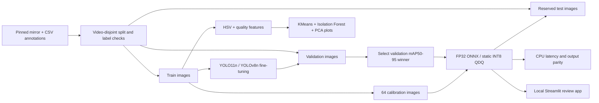

# OceanSight Edge

**Marine-debris detection, honest evaluation, and a working local CPU demo.**

OceanSight Edge helps a reviewer find candidate debris in underwater imagery. It is an independent applied-ML portfolio project motivated by ocean-industry computer vision work, including DeepSense's domain. It is not affiliated with DeepSense and does not promise an interview or autonomous cleanup capability.

The MVP compares two small pretrained detectors on a video-disjoint TrashCan subset, ranks unusual training images with unsupervised learning, exports the selected model to ONNX, tests static INT8 quantization, and exposes a local Streamlit review app. All reported numbers come from scripts. Missing results mean **not run**, not zero.

## Open the demo

On the original Mac:

```sh
cd /Volumes/PortableSSD/Projects/OceanSight-Edge
source .venv/bin/activate
streamlit run app.py --server.address 127.0.0.1 --server.port 8501
```

Open http://localhost:8501. Inspect held-out examples or upload an image/short video. The image path returns boxes, confidence, counts, latency, downloadable JSON and an annotated image. Video processing is capped at 150 frames and exports per-frame counts; those counts are **not unique tracked objects**. Uploaded files are processed locally, and temporary video files are removed afterward.

## Reproduce from source

Tested environment: Apple M4, 16 GB RAM, macOS, Python 3.13. The environment is isolated in `.venv`; no global package changes are required. About 720 small images are downloaded. Budget several GB for Python packages and intermediate training artifacts.

```sh
python3.13 -m venv .venv
source .venv/bin/activate
python -m pip install -r requirements.txt
# requirements-lock.txt captures all installed versions on the original Mac.
python -m oceansight.data --limit 720 --seed 42 --frames-per-video 6
python -m oceansight.audit
python -m pytest -q
python -m oceansight.train --epochs 10 --device mps --imgsz 320
python -m oceansight.edge
python -m oceansight.failures
streamlit run app.py --server.address 127.0.0.1
```

Use `--device cpu` on computers without Apple GPU support. Internet access is needed for dataset files and initial pretrained weights. Run modules from the repository root. The local paths in `data/dataset.yaml` are generated for each checkout. Training reruns get a fresh run directory; exported `models/best.*` and summary reports represent the latest completed experiment. Keep previous reports if you want a long-lived experiment history.

## Data and experimental design

- Source: [TrashCan, University of Minnesota](https://irvlab.cs.umn.edu/resources/trashcan), based on JAMSTEC J-EDI underwater footage.
- Download: [public third-party mirror](https://huggingface.co/datasets/anyaeross/trashcan1), revision `52a49e9cb66002def6777e99d47e04301988f211`. The original archive server returned HTTP 403 during this build. The mirror's conversion has not been compared with the original archive.
- Task: one `marine_debris` class, formed by merging every `trash_*` label. Animals, plants, and ROVs are background for this task. No material-classification claim is made.
- Merge mirror annotation tables, group by `vid_*` filename prefix, assign source videos 70/15/15 to train/validation/test using seed 42, sample up to six temporally spread frames per video, and cap each split. This is a custom subset protocol, **not the official TrashCan benchmark**.
- Exact image hashes and video IDs cannot overlap across splits. Bounding boxes are checked for finite values, clipped to image bounds, and converted to normalized YOLO coordinates. The committed manifest records source annotations, dimensions, hashes, source split, new split, and source video.
- The image inventory comes from annotation rows; entirely unannotated background frames may be absent. Different videos may share locations or expeditions. Video grouping reduces temporal leakage but does not eliminate domain leakage.

## Architecture



## What to inspect

| Evidence | Location | What it means |
|---|---|---|
| Dataset protocol/counts | `reports/dataset.json` | Actual subset composition and limitations |
| Exact input manifest | `reports/manifest.json` | Provenance and split reproducibility |
| Two-model comparison | `reports/comparison.json` | Validation metrics under the same epoch/input-size budget |
| Selected model | `reports/selection.json` | Validation-only selection rule |
| Test evaluation | `reports/test_metrics.json` | Selected model in PyTorch, FP32 ONNX, and completed INT8 variant |
| CPU benchmark | `reports/benchmark.json` | Four-thread, batch-one warm forward latency and raw-output parity |
| Quantization status | `reports/quantization.json` | Explicit success/failure and train-only calibration |
| Unsupervised review | `reports/quality.csv`, `reports/outlier_contact_sheet.jpg` | Appearance outliers, not automatic error labels |
| Failure analysis | `reports/failure_cases.json`, `reports/failure_contact_sheet.jpg` | Fixed-threshold custom-demo detections matched to ground truth |
| Raw runs | `runs/`, `logs/` | Local training curves, configurations and detailed logs |

The generated [results report](docs/RESULTS.md) summarizes the completed run. Data, weights, environments and raw runs are ignored by Git. Derived review images remain local and are ignored by Git pending a redistribution-license review; numerical reports and source are committed.

## Evaluation, optimization and limits

We use **mAP50–95**, which evaluates box precision/recall across IoU thresholds from .50 through .95, and mAP50 as a more forgiving localization measure. They are not image classification accuracy. The selected checkpoint maximizes validation mAP50–95. YOLO11n and YOLOv8n are two related compact detectors; Faster R-CNN/RT-DETR comparisons are future work. One seed and ten epochs do not establish statistical superiority.

The ONNX graph is exported at fixed 320×320, batch one. INT8 uses static calibration with only training images. Test metrics evaluate the exports; the default app remains FP32 ONNX to avoid choosing a variant using the held-out test set. No quantization speedup is assumed. Forward-only benchmarking excludes file decode, resizing and NMS; the app separately measures preprocessing + forward + postprocessing latency. CPU tests on an M4 are not measurements on a robot, Jetson, or Raspberry Pi.

The audit uses standardized HSV histograms and six interpretable quality descriptors. KMeans produces appearance clusters; Isolation Forest ranks unusual feature combinations; PCA shows a 2-D projection. It does **not** extract deep semantic embeddings or infer plastic/metal clusters. All fitting uses training data, and flagged images stay in the dataset for human review.

Expected challenges include tiny debris, low contrast, partial occlusion, natural objects resembling trash, and incomplete labels. See measured failure examples rather than treating these hypotheses as proven causes. Confidence values are not calibrated probabilities. This is a human-review prototype, not navigation or robot-control software.

## Scale-up path

1. Verify annotations against the original TrashCan archive and confirm redistribution permissions.
2. Expand the subset with the same video-group protocol; keep a new locked expedition/location test set.
3. Train longer across several seeds, then compare a second detector family with an explicit accuracy/latency budget.
4. Add pretrained feature embeddings to complement interpretable quality features; manually review ranked candidates.
5. Add material classes only after checking per-class support. Evaluate tracking separately if unique object counts matter.
6. Use validation to choose quantization parameters, then run one final untouched test and profile a physical target device, including memory/power.

## Learn the project

Read [the walkthrough](docs/WALKTHROUGH.md) and [data/model notes](docs/DATA_AND_MODEL_CARD.md). Start with a held-out failure example: explain what the label says, what the model predicted, and which next experiment would test your explanation.

## Attribution and licensing

TrashCan: Jungseok Hong, Michael Fulton, Junaed Sattar, [*TrashCan: A Semantically-Segmented Dataset towards Visual Detection of Marine Debris*](https://arxiv.org/abs/2007.08097). Image rights remain with the original owners; public accessibility is not a redistribution license. This repository does not relicense dataset images, annotations, or pretrained weights. Ultralytics has [AGPL-3.0 / enterprise licensing](https://www.ultralytics.com/license). Review those terms before distributing or deploying this application. Project source is provided under AGPL-3.0; see LICENSE. No remote publication or email sending is performed by this project.

Technical references: [Ultralytics training](https://docs.ultralytics.com/modes/train/), [ONNX export](https://docs.ultralytics.com/modes/export/), [ONNX Runtime quantization](https://onnxruntime.ai/docs/performance/model-optimizations/quantization.html).
