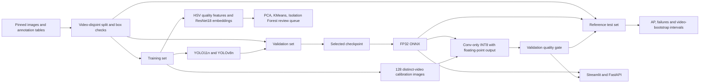
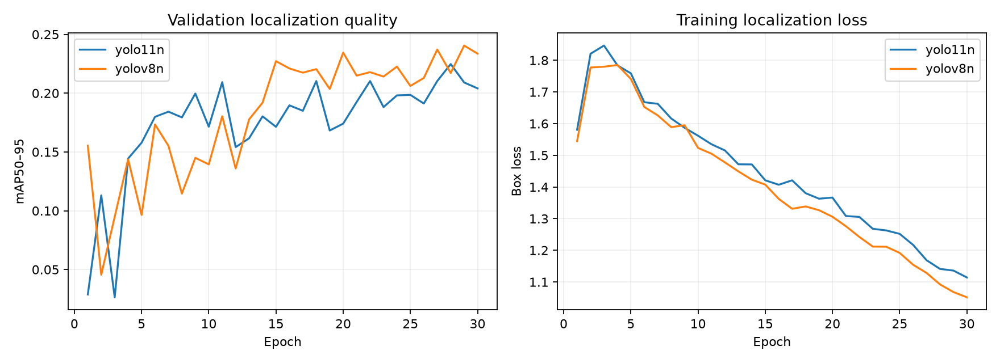
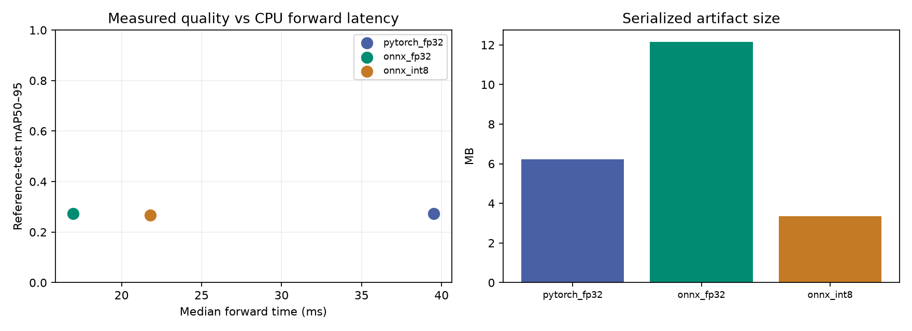

# OceanSight Edge

**Marine-debris detection with model comparison, visual data review, and measured CPU deployment.**

OceanSight Edge turns underwater images or short clips into candidate debris detections that a person can review. It is an independent portfolio project focused on applied computer vision for ocean operations. It is not affiliated with DeepSense.

The project includes two trained detectors, video-disjoint data preparation, pretrained image-embedding analysis, a diagnosed and corrected quantization experiment, a Streamlit review app, a FastAPI prediction service, and a tested Linux inference container. Read [the measured results](docs/RESULTS.md) before quoting any performance claim.

## Try it on the original Mac

```sh
cd /Volumes/PortableSSD/Projects/OceanSight-Edge
./start-demo.command
```

Open [the review app](http://127.0.0.1:8501). Choose a reference-holdout image or upload a JPEG, PNG, MP4 or MOV. Image results include boxes, confidence, pipeline latency, annotated images and JSON. Video results include an annotated MP4 and per-frame count CSV; video counts are not unique tracked objects. The browser demo processes at most 150 frames and keeps uploaded video results in session memory so both downloads remain available.

## Run the prediction API

```sh
source .venv/bin/activate
uvicorn oceansight.api:app --host 127.0.0.1 --port 8000
curl http://127.0.0.1:8000/ready
curl -F 'file=@your-underwater-image.jpg' 'http://127.0.0.1:8000/predict?confidence=0.25'
```

Interactive API documentation is at `/docs`. `/health` reports process health; `/ready` loads and validates model availability. `/predict` returns bounding boxes, image dimensions, runtime and a model SHA-256 fingerprint. Invalid images and thresholds are rejected. Image input is bounded to 10 MB, 20 megapixels and 6000 pixels per side. The local service has no authentication and is intended to stay on localhost.

## Run without the training framework

The inference container uses ONNX Runtime, OpenCV and FastAPI; it does not install PyTorch or Ultralytics. The model is supplied separately so the source repository does not silently distribute pretrained weights.

```sh
docker build -t oceansight-edge:local .
docker create --name oceansight-api -p 127.0.0.1:8000:8000 \
  -e OCEANSIGHT_MODEL=/tmp/model.onnx oceansight-edge:local
docker cp models/best.onnx oceansight-api:/tmp/model.onnx
docker start oceansight-api
curl http://127.0.0.1:8000/ready
# Stop it when finished:
docker stop oceansight-api
```

Copying the model also works when the external SSD is not shared with the Docker VM. An existing container name must be reused with `docker start` or replaced with a new name. The container runs as a non-root user. See [deployment and verification](docs/DEPLOYMENT.md).

## Reproduce the experiment

The tested training machine is an Apple M4 MacBook Air with 16 GB memory and Python 3.13. The environment is isolated in `.venv`. The pinned mirror requires no account or API key. Downloads and initial pretrained weights require network access.

```sh
python3.13 -m venv .venv
source .venv/bin/activate
python -m pip install -r requirements-lock.txt
python -m oceansight.data --limit 2400 --frames-per-video 20 \
  --preserve-holdouts reports/baseline_v1/manifest.json
python -m oceansight.audit
python -m oceansight.embeddings
python -m oceansight.train --epochs 30 --imgsz 416 --device mps --tag v2
python -m oceansight.edge
python -m oceansight.failures
python -m oceansight.statistics
python -m oceansight.report
python -m oceansight.plots
python -m pytest -q
ruff check oceansight app.py tests
```

Use `--device cpu` where MPS is unavailable. The direct dependency list is in `requirements.txt`; the full Mac environment is pinned in `requirements-lock.txt`. `requirements-inference.txt` is the lean container environment. Training uses fresh suffixed run directories and then promotes the validation winner. Keep the reports before starting a new experiment; this repository preserves the initial short experiment under `reports/baseline_v1/`.

Run batch inference without opening the app:

```sh
python -m oceansight.cli your-image.jpg --output local-result
python -m oceansight.cli your-clip.mp4 --max-frames 300 --output clip-result
```

Choose a new output directory for each CLI run. It refuses to overwrite an existing directory.

## Data protocol

[TrashCan](https://irvlab.cs.umn.edu/resources/trashcan) originates from JAMSTEC J-EDI underwater footage. The original archive returned HTTP 403 during this build, so preparation uses [a public CSV/image mirror](https://huggingface.co/datasets/anyaeross/trashcan1), pinned at `52a49e9cb66002def6777e99d47e04301988f211`.

All `trash_*` labels map to one `marine_debris` class. Animal, plant and ROV objects are background for this task. The project detects debris; it does not predict its material.

The pipeline assigns whole source-video IDs to train/validation/test with seed 42 and samples temporally spread frames. The expanded run has **1,680 training images from 213 videos**, **108 validation images from 44 videos**, and **108 test images from 45 videos**. Validation and test image identities are preserved from the first experiment; neither is added to training. Exact duplicate hashes and video overlap are checked. Normalized boxes are generated from validated, clipped coordinates.

The test set is a **reused reference holdout**: its first-version results and failure images were inspected before this expansion. Model selection and quantization gating use validation, but we do not describe this small reused set as a fresh, unbiased final benchmark. Different videos could share a location or expedition. The mirror conversion has not been checked against the original archive, and its annotation-derived inventory may omit fully unannotated negative frames. This is not the official TrashCan evaluation protocol.

## System architecture



## Engineering decisions worth discussing

**Evaluation before claims.** Both compact detectors receive the same epoch budget, image size, data and seed. Validation mAP50–95 chooses the checkpoint/model. They are related YOLO architectures, so this is not a comparison against RT-DETR or Faster R-CNN. AP is not classification accuracy.

**Unsupervised review, not automatic deletion.** One analysis uses interpretable image-quality features. Another extracts frozen 512-dimensional ResNet18 features and applies StandardScaler, PCA, KMeans and Isolation Forest. All fitting uses training data. Clusters have no asserted material labels; outliers remain in training. A video-diverse contact sheet helps prioritize manual review.

**Quantization debugging.** The initial broad INT8 graph quantized a combined coordinate/confidence output at a scale of about 2.04. All confidence values in ten checked validation images became zero. The corrected experiment quantizes convolution layers while keeping the final box/confidence computations floating point. INT8 must retain validation mAP50–95 within 0.02 absolute of FP32 to pass its quality gate. See the actual gate result rather than assuming success.

**Fair timing.** CPU comparison uses the same square tensors, batch one and four threads, with warmups and rotating backend order. Forward-only latency excludes decode, resizing and NMS. The app/API separately report preprocessing + inference + postprocessing time. Container verification demonstrates portability, not a new speed benchmark. No physical Jetson/Pi or power measurements have been performed.

**Evidence includes failures and uncertainty.** Fixed-threshold predictions are matched one-to-one to labels. Failure contact sheets show the largest error counts. Whole-video bootstrap intervals quantify uncertainty in the fixed model's precision and recall; they do not replace multi-seed training or location-disjoint evaluation.





## Evidence map

| Artifact | Purpose |
|---|---|
| `reports/dataset.json`, `reports/manifest.json` | Provenance, source labels, hashes and split membership |
| `reports/comparison.json`, `reports/selection.json` | Validation comparison and model selection |
| `reports/test_metrics.json` | Matched-input PyTorch/ONNX/INT8 AP |
| `reports/benchmark.json` | CPU methodology, latency and numerical parity |
| `reports/quantization_diagnosis.json` | Measured original failure mechanism |
| `reports/quantization_gate.json` | Validation acceptance of the revised INT8 experiment |
| `reports/embeddings.json`, `reports/embedding_review.csv` | Deep-feature review protocol and ranking |
| `reports/failure_cases.json`, `reports/uncertainty.json` | Error counts and video-bootstrap intervals |
| `reports/training/`, `runs/`, `logs/` | Curves, configurations and execution evidence |
| `docs/RESUME.md` | Resume wording generated from completed results |

## Scope and limits

This is a complete local portfolio implementation, not a deployed robot or a claim of broad ocean reliability. Small, partially hidden and low-contrast debris remain challenging. Confidence is not calibrated. There is no tracking, material classifier, depth estimate or navigation/control. Follow-up research should use original annotations, more locations, multiple seeds, a genuinely different detector family, and a new final holdout.

Read [the walkthrough](docs/WALKTHROUGH.md), [model/data card](docs/DATA_AND_MODEL_CARD.md), [results](docs/RESULTS.md), and [deployment guide](docs/DEPLOYMENT.md) before presenting. The source was developed with AI assistance; understanding and being able to modify it matters more than memorizing a polished description.

## Attribution

TrashCan: Jungseok Hong, Michael Fulton and Junaed Sattar, [*TrashCan: A Semantically-Segmented Dataset towards Visual Detection of Marine Debris*](https://arxiv.org/abs/2007.08097). Images originate from JAMSTEC. Dataset images and pretrained weights have separate rights and are not relicensed by this repository. Local image contact sheets are excluded from Git.

Project source is AGPL-3.0; see LICENSE and [Ultralytics licensing](https://www.ultralytics.com/license). Verify original dataset/weight terms before public redistribution or commercial deployment. Technical references: [ONNX Runtime quantization](https://onnxruntime.ai/docs/performance/model-optimizations/quantization.html), [ResNet18 weights](https://docs.pytorch.org/vision/stable/models/generated/torchvision.models.resnet18.html), and [Ultralytics training](https://docs.ultralytics.com/modes/train/).
